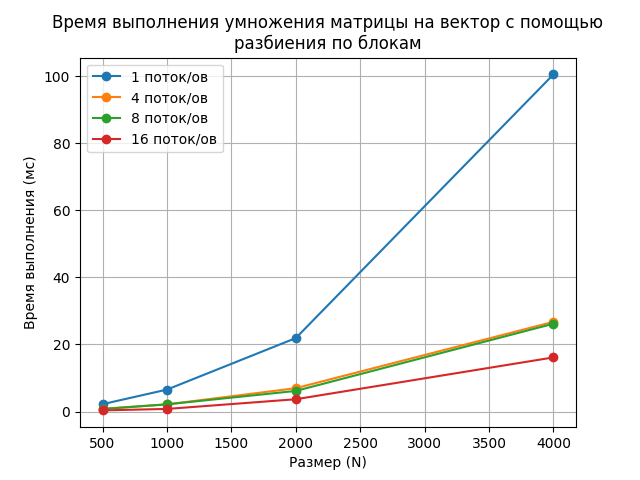

# Лабораторная работа №2 | Линейная алгебра

## Задание 1 | Умножение матрицы на вектор
### Описание задачи и алгоритмы
Необходимо реализовать алгоритмы для умножения матрицы на вектор, используя разбиение по строкам, по столбцам и по блокам.

Код реализованной программы: [task1.cpp](task1/task1.cpp)

Алгоритмы:
* Умножение по строкам: происходит распределение строк матрицы по процессам, после чего производится умножение строк на вектор и объединяются все вычесленные локальные результаты
* По столбцам: происходит передача матрицы в каждый из процессов, после чего суммируются все вычесленные локальные результаты
* По блокам: происходит деление матрицы на блоки NxN, поcле чего каждый из блоков умножается на часть исходного вектора в соответсвии со строками

### Сборка и запуск
Сбока:
```ps
mpic++ task1/task1.cpp
```
Запуск:
```ps
 mpiexec -n num_threads task1/task1 matrix_size algo_name 
```
num_threads - количество потоков

matrix_size - размер матрицы NxN

algo_name - наименование алгоритма (возможные значения: row, column, block)

Пример:

```ps
mpiexec -n 8 task1/task1 100 block
```
### Исследование производительности
При каждом запуске программы матрица и вектор заполняются случайными числами и прогоняется цикл на 100 итераций, с помощью которого вычисляется среднее время выполнения, которое записывается в файл time.txt

Также был написан скрипт [generate.py](task1/analyze.py), который запускает программу по указанному алгоритму, комбинируя различные количества потоков и размеров матрицы. В результате выполнения данного скрипта формируются графики времени выполнения программы

Запуск:
```ps
python analyse.py
```
Инфраструктура:
```ps
gcc (GCC) 13.2.0
AMD Ryzen 5 3500U with Radeon Vega Mobile Gfx     2.10 GHz
```


| Кол-во процессов\ размер |   500   |  1000   |   2000    |  4000   |
| ------------------- | ------ | ------- | -------- | ------- |
|         1           | 1.96325 ms |  7.43604 ms |26.7971 ms|115.878 ms|
|         4           | 0.707037 ms| 2.2547 ms |8.36381 ms |24.2762 ms |
|         8           | 0.570209 ms |1.52836 ms| 4.23553 ms| 15.0125 ms |
|         16          | 0.268358 ms| 0.857967 ms | 2.63864 ms  | 12.5025 ms |

|Размер| N процессов | Ускорение | Эффективность |
|------|-------------|-----------|---------------|
| 500  | 1           | 1         | 1             |
| 500  | 4           | 2.78      | 0.69          |
| 500  | 8           | 3.44      | 0.43          |
| 500  | 16          | 7.32      | 0.46          |
| 1000 | 1           | 1         | 1             |
| 1000 | 4           | 3.29      | 0.82          |
| 1000 | 8           | 4.68      | 0.58          |
| 1000 | 16          | 8.67      | 0.54          |
| 2000 | 1           | 1         | 1             |
| 2000 | 4           | 3.2       | 0.8           |
| 2000 | 8           | 6.33      | 0.79          |
| 2000 | 16          | 10.15     | 0.63          |
| 4000 | 1           | 1         | 1             |
| 4000 | 4           | 4.77      | 1.1           |
| 4000 | 8           | 7.72      | 0.96          |
| 4000 | 16          | 9.27      | 0.58          |


| Кол-во потоков\ размер |   500   |  1000   |   2000    |  4000   |
| ------------------- | ------ | ------- | -------- | ------- |
|         1           | 2.16121 ms | 7.37413 ms |53.4947 ms|328.534 ms|
|         4           | 0.613714 ms| 2.76113 ms |14.2507 ms |63.6199 ms |
|         8           | 0.632705 ms |3.68011 ms| 12.1737 ms| 58.6454 ms |
|         16          | 0.315415 ms| 1.31615 ms | 8.31474 ms  | 56.3293 ms |

|Размер| N процессов | Ускорение | Эффективность |
|------|-------------|-----------|---------------|
| 500  | 1           | 1         | 1             |
| 500  | 4           | 3.52      | 0.88          |
| 500  | 8           | 3.42      | 0.43          |
| 500  | 16          | 6.85      | 0.43          |
| 1000 | 1           | 1         | 1             |
| 1000 | 4           | 2.67      | 0.67          |
| 1000 | 8           | 2         | 0.25          |
| 1000 | 16          | 5.6       | 0.35          |
| 2000 | 1           | 1         | 1             |
| 2000 | 4           | 3.75      | 0.94          |
| 2000 | 8           | 4.39      | 0.55          |
| 2000 | 16          | 6.43      | 0.4           |
| 4000 | 1           | 1         | 1             |
| 4000 | 4           | 5.16      | 1.2           |
| 4000 | 8           | 5.6       | 0.7           |
| 4000 | 16          | 5.83      | 0.36          |



| Кол-во потоков\ размер |   500   |  1000   |   2000    |  4000   |
| ------------------- | ------ | ------- | -------- | ------- |
|         1           | 2.18827 ms | 6.53351 ms |21.8905 ms|100.507 ms|
|         4           | 0.825685 ms| 2.12264 ms |6.95343 ms |26.7397 ms |
|         8           | 0.736205 ms |2.13733 ms| 6.13371 ms| 26.1735 ms |
|         16          | 0.330051 ms| 0.769111 ms | 3.75985 ms  | 16.1277 ms |

|Размер| N процессов | Ускорение | Эффективность |
|------|-------------|-----------|---------------|
| 500  | 1           | 1         | 1             |
| 500  | 4           | 2.65      | 0.66          |
| 500  | 8           | 2.97      | 0.37          |
| 500  | 16          | 6.63      | 0.41          |
| 1000 | 1           | 1         | 1             |
| 1000 | 4           | 3.07      | 0.67          |
| 1000 | 8           | 3.05      | 0.25          |
| 1000 | 16          | 5.6       | 0.35          |
| 2000 | 1           | 1         | 1             |
| 2000 | 4           | 3.75      | 0.94          |
| 2000 | 8           | 4.39      | 0.55          |
| 2000 | 16          | 8.49      | 0.53          |
| 4000 | 1           | 1         | 1             |
| 4000 | 4           | 3.76      | 0.94          |
| 4000 | 8           | 3.84      | 0.48          |
| 4000 | 16          | 6.23      | 0.39          |

*Есть некоторые погрешности в эффективности именно на 4 процессах, увы, так и не удалось понять, в чем именно дело

## Задание 2 | Матричное умножение по алгоритму Кэннона
### Описание задачи и алгоритмы
